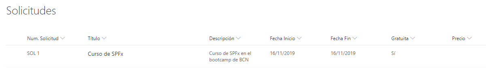

# Creación de la lista de solicitudes

Debemos crear una lista donde guardaremos las solicitudes de formación recibidas. Para ello crearemos las siguienes columnas:

* __Descripción__: Varías líneas de texto.
* __Fecha Inicio__: Fecha y hora.
* __Fecha Fin__: Fecha y hora.
* __Gratuita__: Sí o No.
* __Precio__: Moneda.
* __Num. Solicitud__: Calculado (__="SOL" & ID__)

Que quedaría de la forma siguiente:

