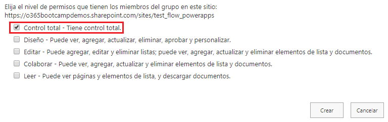
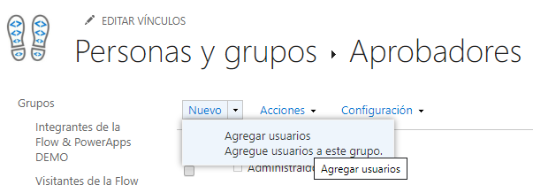

# Creación del grupo de aprobadores

En esta parte del laboratorio crearemos un grupo de usuarios que tendrán permisos para aprobar las solicitudes recibidas. Los pasos a realizar son los siguientes:

1. Ir a los **permisos del sitio**

2. Seleccionar **configuración de permisos avanzada**.

3. Crear un grupo llamado **Aprobadores** haciendo click en el icono __Crear Grupo__.

4. Dar permiso a los miembros del grupo de **Control Total**.

5. Para añadir miembros al grupo creado, deberemos seleccionarlo y hacer click en __Agregar Usuarios__.

6. Añadiremos a los usuarios que queramos que formen parte del grupo.

