# Personalización del formulario de Power Apps

En esta parte del laboratorio vamos a personalizar el formulario de entrada de datos en la lista de SharePoint con Microsoft Power Apps.

## Creación del formulario

Desde la lista de SharePoint deberemos hacer click en **Personalizar el formulario**.

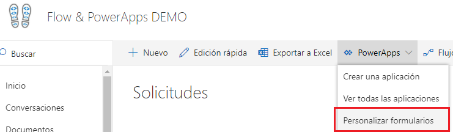

Seguidamente se abrirá Power Apps con el formulario que vamos a personalizar:

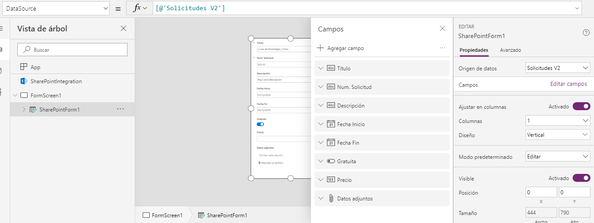

## Modificación del formulario

En esta parte del ejercicio vamos a modificar el formulario con los cambios siguientes:

1. Hacer que el campo con el **número de solicitud** sea de solo lectura.

En primer lugar situaremos el campo en la parte superior del formulario:

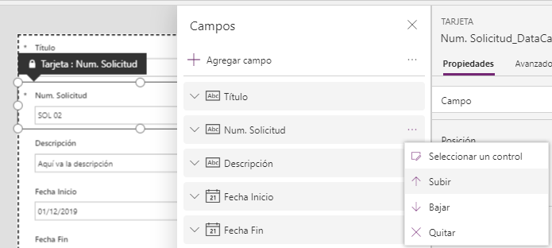

A continuación deberemos **desbloquear el campo** para poder editarlo y hacerlo unicamente de lectura.

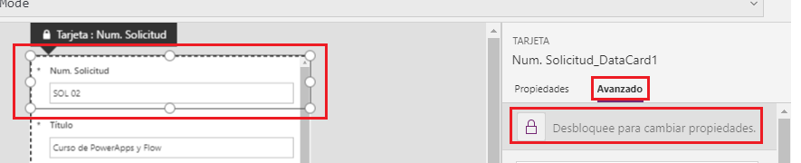

Finalmente haremos que el campo sea de solo lectura:

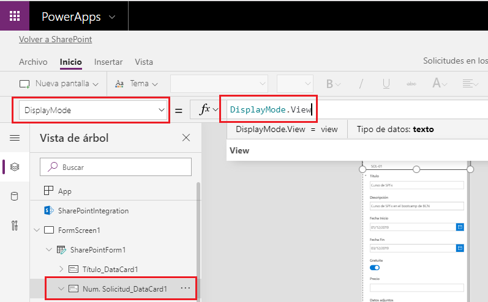

2. Si el curso es gratuito, deberemos ocultar el campo **Precio**.

En primer lugar, deberemos desbloquear el campo, como hemos hecho anteriormente:

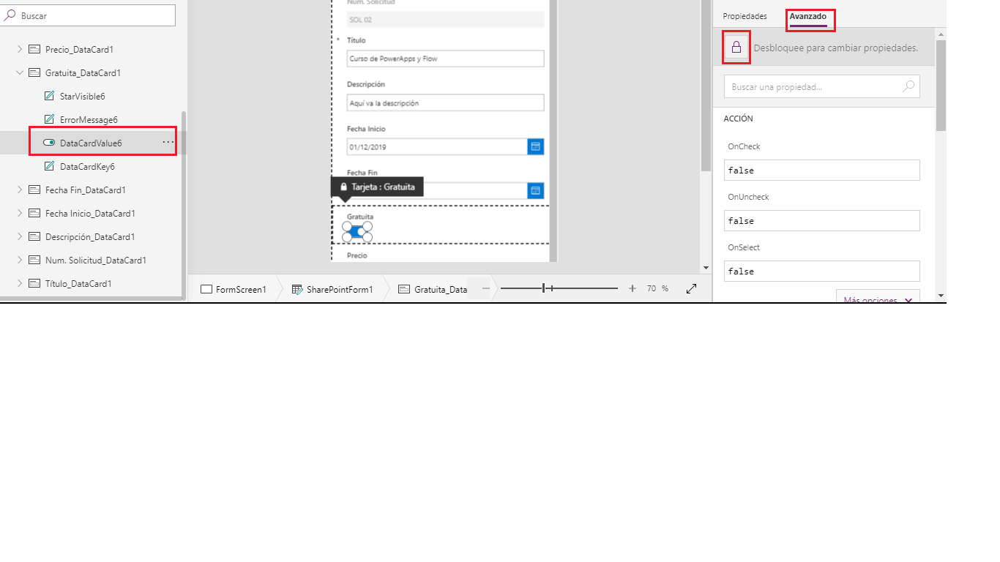

Seguidamente haremos que al modificar el valor del campo **Gratuita** (evento _onCheck_) se actualice el valor de la variable **miVariable** que hemos creado previamente:

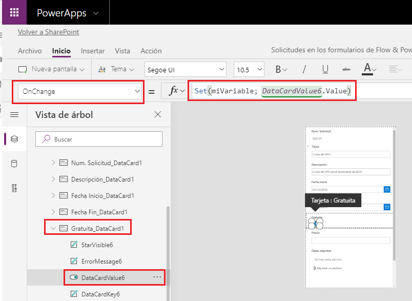

Finalmente, haremos que la propiedad _Visible_ del campo **Precio** dependa del valor de la variable **miVariable**.

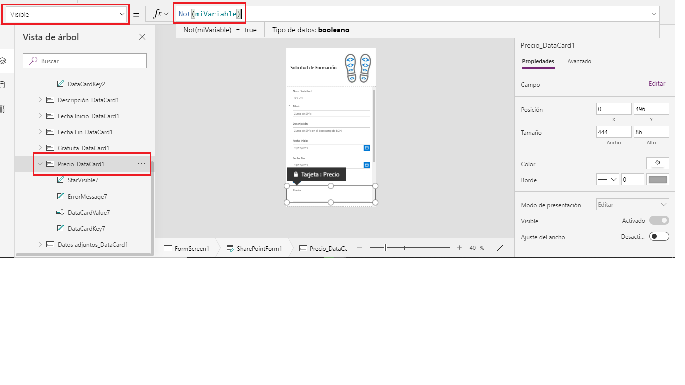

3. Añadir una imagen al formulario.

Desplazaremos el conjunto de controles hacia la parte inferior del formulario, de forma que podamos añadir una imagen y una título:

Después añadiremos dos controles (**imagen** y **etiqueta**) para mostrar algo como esto:

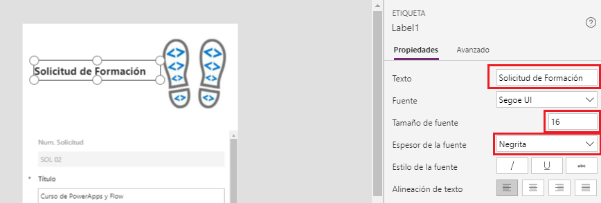

## Publicación del Formulario

Para poder publicar el formulario, primero deberemos guardar los cambios:

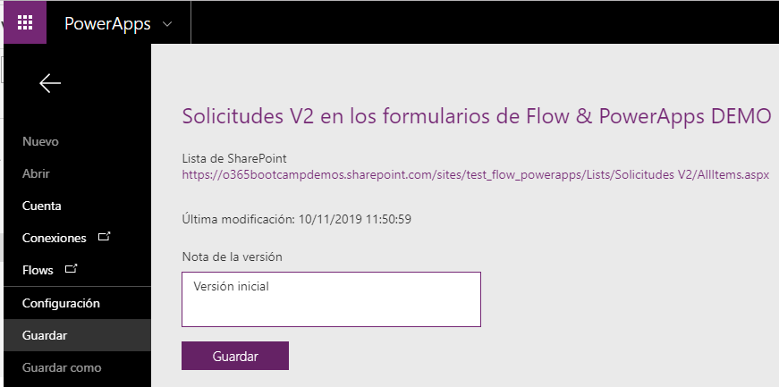

Y finalmente ya podremos publicarlo y hacerlo visible para el resto de usuarios:

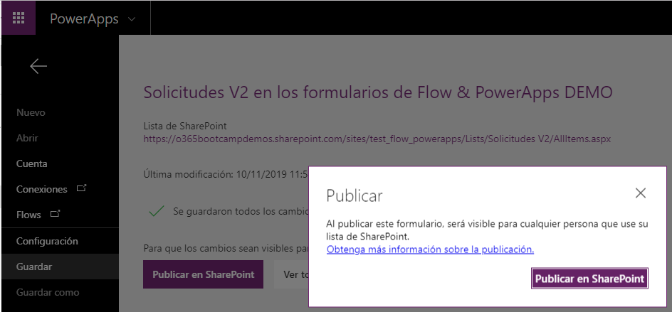

Si nos vamos a SharePoint y probamos a crear una nueva solicitud, el formulario modificado debería aparecer.
