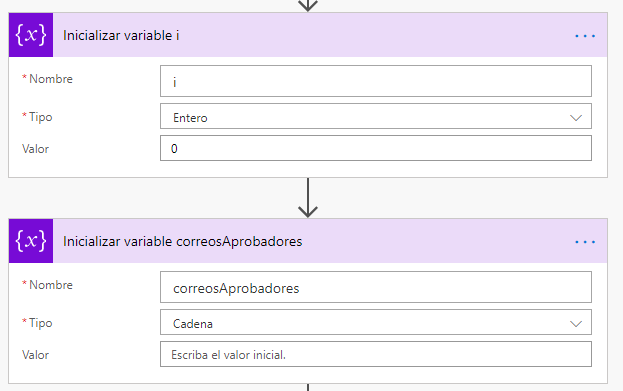

# Creación del flujo de Aprobación con Power Automate

En esta parte del laboratorio vamos a crear un flujo de aprobación para las solicitudes recibidas con Microsoft Power Automate.

## Creación del flujo y primeros pasos

Los pasos a realizar para crear el flujo son los siguientes:

1. Para crear un flujo, iremos a __Mis Flujos__ y seleccionaremos __Automatizado: desde cero__.

2. El desencadenador que deberemos elegir para disparar el flujo es **Cuando un item es creado o modificado** dentro de los disparadores disponibles para **SharePoint**.

## Obtención de los miembros del grupo de Aprobadores

Para poder enviar la solicitud de aprobación a los aprobadores, primeramente deberemos buscar cuáles son los miembros del grupo con los siguientes pasos:

1. Añadir una acción para **enviar una solicitud HTTP a SharePoint**, indicando la dirección del sitio, y la URI ___api/web/sitegroups/GetByName('Aprobadores')/users__.

2. Guardaremos los resultados de la llamada en una **variable**, que inicializaremos con el valor de la salida del paso previo:

3. Una vez tenemos la lista de usuarios aprobadores, deberemos guardarnos en otra variable sus direcciones de correo electrónico, ya que es el único dato que ahora nos interesa. Para ello deberemos crear 2 variables:

4. En este paso recorreremos la lista obtenida en el paso 1, y para cada elemento, nos guardaremos su dirección de correo electronico. Para ello deberemos seleccionar una acción de tipo **Control** **Para cada uno**, donde nos guardaremos en la variable i el índice del paso.

De esta manera, en la variable **correosAprobadores** tendremos guardadas las direcciones de correo electrónico de los miembros del grupo **Aprobadores**, a los cuáles deberemos enviar las solicitudes de aprobación.

## Uso de Aprobaciones

Para poder crear una aprobación, deberemos hacer uso de las acciones de **Aprobaciones** dentro de Microsoft Power Automate. Los pasos que debemos realizar son:

1. Crear una nueva solicitud de aprobación, donde todos los miembros que la reciban, la deben aprobar. Por este motivo, la aprobación se asignará (campo __Assigned To__) a los miembros que tenemos guardados en la variable **correosAprobadores**. En los detalles podremos añadir un mensaje con los datos que queramos mostrar en la solicitud.

2. Las personas encargadas de aprobar o rechazar la solicitud recibirán automáticamente un correo electrónico para llevar a cabo la acción. Aun así, a nosotros también nos interesa enviar un mensaje en Teams con una tarjeta adaptativa. Por este motivo, a cada usuario aprobador le enviaremos un mensaje en Teams:

3. En este punto pararemos la ejecución del flujo, a la espera de la respuesta de todos los usuarios aprobadores.

4. Seguidamente debemos comprobar el resultado de la aprobación (el valor de la variable **Result** debe ser __Approve__), donde enviaremos un correo electrónico al solicitante indicando el resultado de la misma.

5. Finalmente, actualizaremos la solicitud almacenada en SharePoint con el nuevo estado (accion **Actualizar elemento**).

