# Graph api en una Teams Tab con Xfx

## Requisitos
Para la realización de este laboratorio necesitaremos lo mismo que necesitariamos para un desarrollo en Spfx más un canal de Teams sobre el que agregar el nuevo tab.

## Creando el proyecto

En primer lugar vamos a crear el proyecto con Yeoman al igual que cualquier otra solución de SharePoint Framework.
Como siempre empezamos ejecutando Yeoman en el directorio que hemos creado previamente donde se almacenará nuestro proyecto:
```bash
yo @microsoft/sharepoint
```

Rellenamos los datos tal y como se ven en la imagen. 

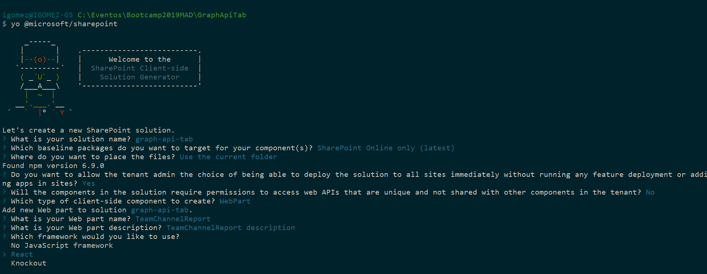

Esperamos a que Yeoman termine de ejecutarse y nos cree toda la estructura del proyecto.

Una vez finalizado el proceso, procedemos a abrir el proyecto con Visual Studio Code:

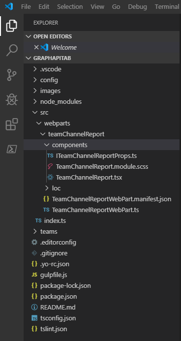

## Picando código
### Configurando el webpart

Lo primero que debemos hacer es modificar el manifiesto del webpart para habilitar el que funcione en Teams, para ello en la propiedad *"supportedHosts"* añadiremos un nuevo elemento **"TeamsTab"**:
```json
{
  "$schema": "https://developer.microsoft.com/json-schemas/spfx/client-side-web-part-manifest.schema.json",
  "id": "4b1b8dd2-6219-4c56-b428-7c843ce4fda1",
  "alias": "TeamChannelReportWebPart",
  "componentType": "WebPart",

  // The "*" signifies that the version should be taken from the package.json
  "version": "*",
  "manifestVersion": 2,

  // If true, the component can only be installed on sites where Custom Script is allowed.
  // Components that allow authors to embed arbitrary script code should set this to true.
  // https://support.office.com/en-us/article/Turn-scripting-capabilities-on-or-off-1f2c515f-5d7e-448a-9fd7-835da935584f
  "requiresCustomScript": false,
  "supportedHosts": ["SharePointWebPart", "TeamsTab"],

  "preconfiguredEntries": [{
    "groupId": "5c03119e-3074-46fd-976b-c60198311f70", // Other
    "group": { "default": "Other" },
    "title": { "default": "TeamChannelReport" },
    "description": { "default": "TeamChannelReport description" },
    "officeFabricIconFontName": "Page",
    "properties": {
      "description": "TeamChannelReport"
    }
  }]
}
```

### Configurando los permisos de Graph API en el webpart

Una parte fundamental para que en nuestros desarrollos Xfx funcionen las llamadas al Graph API es la configuración de los permisos. Para ello debemos agregar en el fichero *package-solution.json* el siguiente código:
```json
"webApiPermissionRequests": [
      {
        "resource": "Microsoft Graph",
        "scope": "Group.Read.All"
      },
      {
        "resource": "Microsoft Graph",
        "scope": "Group.ReadWrite.All"
      }
]
```
Con estos permisos a través del Graph API podremos leer y escribir mensajes sobre un canal de Teams.

Una vez agreguemos los permisos nos quedará un código similar a este en el archivo *package-solution.json*:

```json
{
  "$schema": "https://developer.microsoft.com/json-schemas/spfx-build/package-solution.schema.json",
  "solution": {
    "name": "graph-api-tab-client-side-solution",
    "id": "8ce2f526-f858-4c34-a828-f4ae5fc68860",
    "version": "1.0.0.0",
    "includeClientSideAssets": true,
    "skipFeatureDeployment": true,
    "isDomainIsolated": false,
    "webApiPermissionRequests": [
      {
        "resource": "Microsoft Graph",
        "scope": "Group.Read.All"
      },
      {
        "resource": "Microsoft Graph",
        "scope": "Group.ReadWrite.All"
      }
]
  },
  "paths": {
    "zippedPackage": "solution/graph-api-tab.sppkg"
  }
}
```


### Primeros pasos

Lo interesante de un desarrollo para Teams en Xfx, es que la apliación pueda interactuar con los elementos que componen el Team o canal donde se está ejecutando. Por lo que en primer lugar debemos saber dónde estamos y para ello debemos cargar el contexto de Teams que no es más que un objeto que contendrá bastante información respecto a donde se está ejecutando.

Para ello comenzamos haciendo un import en *TeamChannelReportWebPart.ts*:
```typescript
import * as microsoftTeams from '@microsoft/teams-js';
```

A continuación agregamos una variable privada en la clase del webpart:
```typescript
private _teamsContext: microsoftTeams.Context;
```

Para que esa variable se inicialice, implementaremos el método *onInit* del WebPart de la siguiente manera:
```typescript
  protected onInit(): Promise<any> {
    let retVal: Promise<any> = Promise.resolve();
    if (this.context.microsoftTeams) {
      retVal = new Promise((resolve, reject) => {
        this.context.microsoftTeams.getContext(context => {
          this._teamsContext = context;
          resolve();
        });
      });
    }
    return retVal;
  }
```

En este punto si este WebPart se está ejecutando en una pestaña en Teams, en el método *onInit* tendremos un objeto con unas cuantas propiedades con información muy útil de cara a interactuar con el canal a través de Graph API.

### Componiendo la props para nuestro componente principal

En primer lugar vamos a modificar las props de nuestro componente principal en el archivo *ITeamChannelReportProps.ts*. Para ello sustituimos el código por el siguiente:
```typescript
import { MSGraphClientFactory } from "@microsoft/sp-http";

export interface ITeamChannelReportProps {
  groupId: string;
  channelId: string;
  factory: MSGraphClientFactory;
  userObjectId: string;
}
```

A continuación, sobre el archivo *TeamChannelReportWebPart.ts* reemplazamos el método render por el siguiente código:
```typescript
  public render(): void {
    const element: React.ReactElement<ITeamChannelReportProps > = React.createElement(
      TeamChannelReport,
      {
        groupId: this._teamsContext.groupId,
        channelId: this._teamsContext.channelId,
        factory: this.context.msGraphClientFactory,
        userObjectId: this._teamsContext.userObjectId
      }
    );

    ReactDom.render(element, this.domElement);
  }
```

Básicamente lo que estamos haciendo es pasarle los datos necesarios para hacer llamadas a Graph API, por un lado el *GraphClientFactory* que usaremos para obtener el cliente que se encargará de hacer las llamadas, y por el otro lado los datos relativos al contexto de Teams que usaremos para componer la url de la llamada.

### Desarrollando nuestro componente principal

Sobre el archivo *TeamChannelReport.tsx* realizaremos los siguientes cambios.

En primer lugar agregamos un interfaz que definirá el estado del componente:
```typescript
export interface ILastItem {
  messageDate: Date;
  webUrl: string;
}

export interface ITeamChannelReportState {
  selectedTab: string;
  numberOfMessages: number;
  lastMessage: ILastItem;
  numberOfFiles: number;
  lastFileUploaded: ILastItem;
  isCurrentUserFirstMessageCreator: Boolean;
}
```

Modificamos la definición de la clase agregando el estado a la misma:
```typescript
export default class TeamChannelReport extends React.Component<ITeamChannelReportProps, ITeamChannelReportState>
```

Incluimos un constructor para inicializar el estado:
```typescript
  constructor(props: ITeamChannelReportProps) {
    super(props);
    this.state = {
      selectedTab: "MESSAGES",
      numberOfMessages: 0,
      lastMessage: { messageDate: new Date(), webUrl: "" },
      numberOfFiles: 0,
      lastFileUploaded: { messageDate: new Date(), webUrl: "" },
      isCurrentUserFirstMessageCreator: false
    };
  }
```

Añadimos los siguientes imports que necesitaremos:
```typescript
import { MSGraphClient } from '@microsoft/sp-http';

import { PivotItem, Pivot } from 'office-ui-fabric-react/lib/Pivot';
import { Label } from 'office-ui-fabric-react/lib/Label';
import { PrimaryButton } from 'office-ui-fabric-react';
```

Sustituimos el método render por el siguiente código:
```typescript
  public render(): React.ReactElement<ITeamChannelReportProps> {
    return (
      <Pivot onLinkClick={this.onLinkClick} selectedKey={this.state.selectedTab} >
        <PivotItem itemKey="MESSAGES" headerText="Messages" itemCount={this.state.numberOfMessages} >
          <Label>You have posted {this.state.numberOfMessages} messages on this channel</Label>
          {this.state.numberOfMessages > 0 && <Label>You have posted your last message on {this.state.lastMessage.messageDate.toLocaleString()}</Label>}
        </PivotItem>
        <PivotItem itemKey="FILES" headerText="Files" itemCount={this.state.numberOfFiles} >
          <Label>You have uploaded {this.state.numberOfFiles} files on this channel</Label>
          {this.state.numberOfFiles > 0 && <Label>You have uploaded your last file on {this.state.lastFileUploaded.messageDate.toLocaleString()}</Label>}
        </PivotItem>
        <PivotItem itemKey="FIRSTCREATOR" headerText="First Creator" itemCount={this.state.isCurrentUserFirstMessageCreator ? 1 : 0} >
          {this.state.isCurrentUserFirstMessageCreator ? (
            <div>
              <Label>You are the user with more messages created on this channel</Label>
              <PrimaryButton text="Post award" onClick={this.postMessage} />
            </div>
          ) : (
              <Label>You are not the user with more messages created on this channel</Label>
            )}
        </PivotItem>
      </Pivot>
    );
  }
```

Agregamos el siguiente método al componente para gestionar la actualización de los datos por pestaña:
```typescript
  private onLinkClick = (item: PivotItem) => {
    console.log(item.props.itemKey);
    switch (item.props.itemKey) {
      case "FILES":
        this.updateFileInformation();
        break;
      case "MESSAGES":
        this.updateNumberOfMessages();
        break;
      case "FIRSTCREATOR":
        this.checkFirstMessageCreator();
        break;
    }
  };
```

Los siguientes métodos que se agregarán son los que se encargarán de realizar las llamadas al Graph API para recuperar la información relativa a los mensajes del canal.

#### Mensajes creados en el canal por el usuario:
```typescript
  private updateNumberOfMessages = () => {
    this.props.factory
      .getClient()
      .then((client: MSGraphClient): void => {
        client
          .api('https://graph.microsoft.com/beta/teams/' + this.props.groupId + '/channels/' + this.props.channelId + '/messages')
          .get((error, response: any, rawResponse?: any) => {
            if (response) {
              let currentUserMessages = response.value.filter(message => message.from.user.id === this.props.userObjectId);
              this.setState({
                ...this.state,
                numberOfMessages: currentUserMessages.length,
                lastMessage: this.getLastMessageData(currentUserMessages),
                selectedTab: "MESSAGES"
              })
            }
            else {
              console.log(error);
            }
          });
      });
  }

  private getLastMessageData = (messages: any): ILastItem => {
    if (messages.length > 0) {
      let parsedMessages = messages.map((message) => {
        return {
          createdDateTime: message.createdDateTime,
          webUrl: message.webUrl,
        };
      });
      parsedMessages.sort((a, b) => (a.createdDateTime < b.createdDateTime) ? 1 : ((b.createdDateTime < a.createdDateTime) ? -1 : 0));
      return { messageDate: new Date(parsedMessages[0].createdDateTime), webUrl: parsedMessages[0].webUrl };
    }
    return { messageDate: new Date(), webUrl: "" };
  }
```

#### Archivos creados en el canal por el usuario:
```typescript
  private updateFileInformation = () => {
    this.props.factory
      .getClient()
      .then((client: MSGraphClient): void => {
        client
          .api('https://graph.microsoft.com/beta/teams/' + this.props.groupId + '/channels/' + this.props.channelId + '/messages')
          .get((error, response: any, rawResponse?: any) => {
            if (response) {
              let currentUserMessages = response.value.filter(message => message.from.user.id === this.props.userObjectId);
              let fileParsedMessages = this.getFileMessages(currentUserMessages);

              this.setState({
                ...this.state,
                numberOfFiles: fileParsedMessages.length,
                lastFileUploaded: this.getLastFileData(fileParsedMessages),
                selectedTab: "FILES"
              })
            }
            else {
              console.log(error);
            }
          });
      });
  }

  private getFileMessages = (messages: any): any[] => {
    let attachmentMessages = messages.filter(message => message.attachments.length > 0);
    let parsedMessages = attachmentMessages.map((message) => {
      return message.attachments.map((attachment) => {
        return {
          contentType: attachment.contentType,
          createdDateTime: message.createdDateTime
        }
      })
    });
    return parsedMessages.flat().filter(parsedMessage => parsedMessage.contentType === "reference");
  }

  private getLastFileData = (messages: any): ILastItem => {
    if (messages.length > 0) {
      messages.sort((a, b) => (a.createdDateTime < b.createdDateTime) ? 1 : ((b.createdDateTime < a.createdDateTime) ? -1 : 0));
      return { messageDate: new Date(messages[0].createdDateTime), webUrl: messages[0].webUrl };
    }
    return { messageDate: new Date(), webUrl: "" };
  }
```

#### Control de award al usuario:
```typescript
  private checkFirstMessageCreator = () => {
    this.props.factory
      .getClient()
      .then((client: MSGraphClient): void => {
        client
          .api('https://graph.microsoft.com/beta/teams/' + this.props.groupId + '/channels/' + this.props.channelId + '/messages')
          .get((error, response: any, rawResponse?: any) => {
            if (response) {
              let creators = [];
              let numberOfMessages = [];
              for (let i = 0; i < response.value.length; i++) {
                let user = response.value[i].from.user.id
                let creatorIndex = creators.indexOf(user);
                if (creatorIndex === -1) {
                  creators.push(user);
                  numberOfMessages.push(1);
                } else {
                  numberOfMessages[creatorIndex]++;
                }
              }
              let maxNumberOfMessages = Math.max(...numberOfMessages);
              let isCurrentUserFirstMessageCreator = false;
              for (let i = 0; i < numberOfMessages.length; i++) {
                if (numberOfMessages[i] === maxNumberOfMessages && creators[i] === this.props.userObjectId) {
                  isCurrentUserFirstMessageCreator = true;
                }
              }
              this.setState({
                ...this.state,
                isCurrentUserFirstMessageCreator: isCurrentUserFirstMessageCreator,
                selectedTab: "FIRSTCREATOR"
              })
            }
            else {
              console.log(error);
            }
          });
      });
  }

  private postMessage = () => {
    this.props.factory
      .getClient()
      .then((client: MSGraphClient): void => {
        client
          .api('https://graph.microsoft.com/beta/teams/' + this.props.groupId + '/channels/' + this.props.channelId + '/messages')
          .post({
            /*             body: {
                          content: "Hello World" */
            subject: null,
            body: {
              contentType: "html",
              content: "<attachment id=\"74d20c7f34aa4a7fb74e2b30004247c5\"></attachment>"
            },
            attachments: [
              {
                id: "74d20c7f34aa4a7fb74e2b30004247c5",
                contentType: "application/vnd.microsoft.card.thumbnail",
                contentUrl: null,
                content: "{\r\n  \"title\": \"Champion of the channel\",\r\n  \"subtitle\": \"<h3>Join me to celebrate</h3>\",\r\n  \"text\": \"I have been awarded as the most prolific message creator on this channel\", \r\n}",
                name: null,
                thumbnailUrl: null
              }
            ]

          },
            (error, response: any, rawResponse?: any) => {
              console.log(error);
              console.log(response);
              console.log(rawResponse);
              this.setState({
                ...this.state,
                isCurrentUserFirstMessageCreator: false,
                selectedTab: "MESSAGES"
              })
            });
      });
  }
```
#### Inicialización del componente:
Por último inicializaremos la primera pestaña en el evento *componentDidMount*:
```typescript
  public componentDidMount() {
    this.updateNumberOfMessages();
  }
```


## Despleguemos nuestro WebPart

La manera de desplegar este tipo de desarrollo es prácticamente igual a un WebPart normal para Spfx salvo algunas pequeñas diferencias. Comencemos...

Primero empaquetamos la solución:
```typescript
gulp bundle --ship
```
```typescript
gulp package-solution --ship
```

A continuación nos toca desplegar sobre el *Catálogo de aplicaciones*:
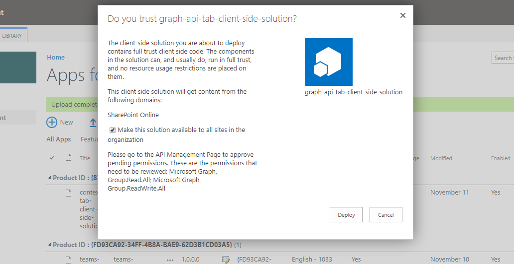

Importante que marquemos el check *"Make this solution available to all sites in the organization"*

Una vez desplegado, y con objetivo de tenerlo disponble en Microsoft Teams, es importante seleccionar el paquete y pulsar el botón *"Sync to Teams"*
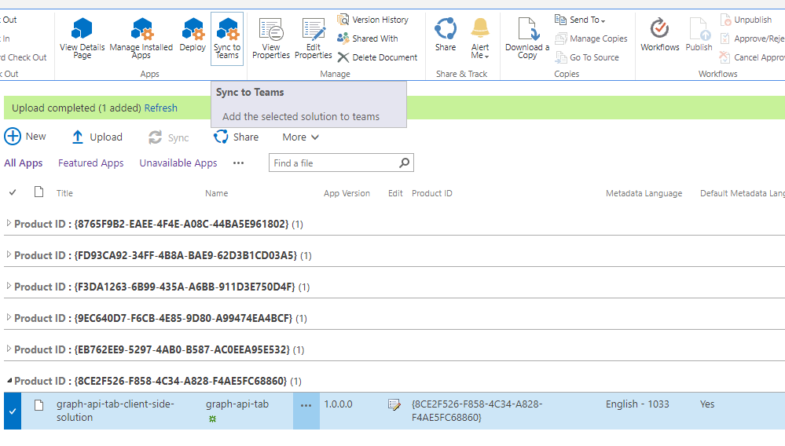

Si todo hay ido bien obtendremos el mensaje *"Succesfully synced teams solution"*.
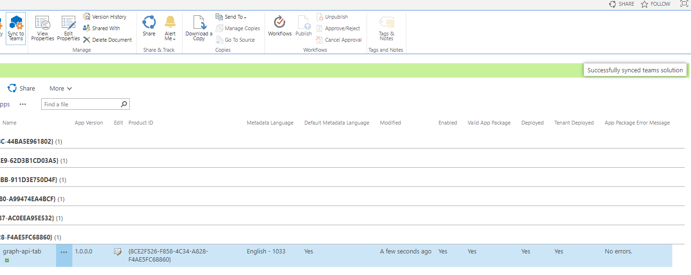

### API Management

Una parte fundamental del proceso, es la de confirmar los permisos adecuados que hemos configurado para el Graph API en nuestra solución de Xfx. Por ello, una vez que desplegamos el paquete en el catálogo de aplicaciones, un administrador debe aprobar esos permisos para que se hagan efectivos y nuestro webpart pueda realizar esas llamadas con el token de seguridad correspondiente.

Para aprobar esos permisos debemos ir a la administración de SharePoint, a la sección *"API management"*:
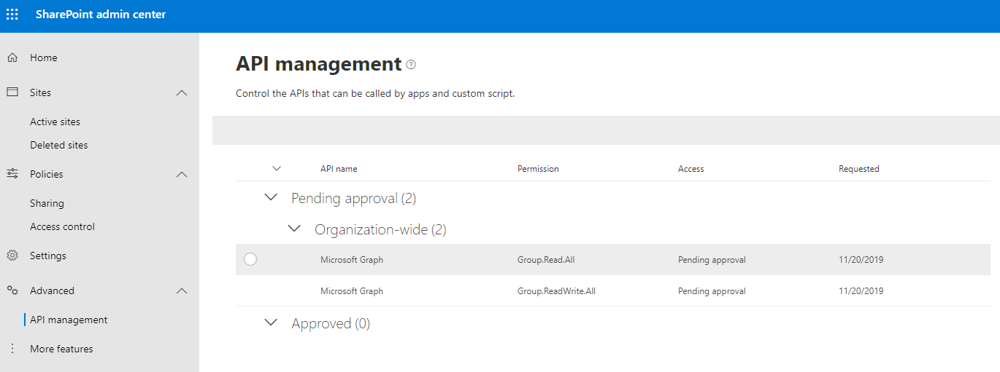

Como vemos en la imagen anterior, en la sección *"Pending approval"* tenemos los dos permisos que hemos incluido en nuestra solución.

Ahora simplemente seleccionamos ambos permisos y pulsamos sobre el botón *"Approve or reject"*:
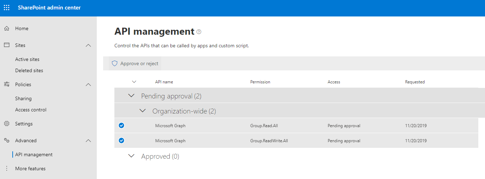

Nos aparece un aviso informandonos de que si aprobamos estos permisos estarán disponibles para todas las aplicaciones, no únicamente para nuestra aplicación. Pulsamos *"Approve"*:
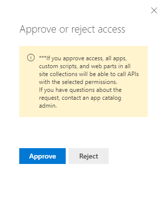

Una vez finalizado este proceso nos aparecerán los permisos en la sección "*Approved"*:
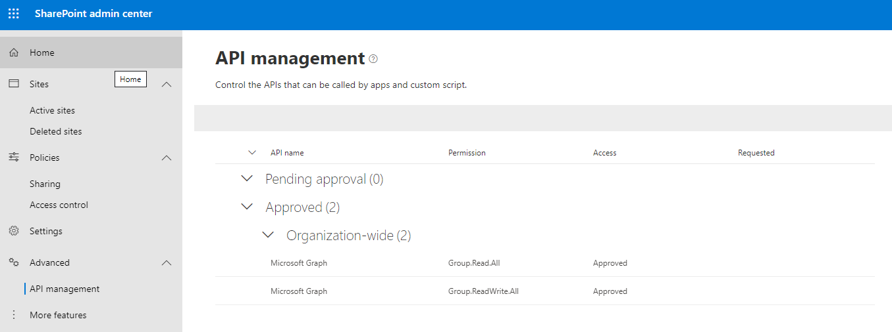


## Probemos en Teams

Ha llegado ya el momento de probar nuestro WebPart en Teams como Tab. Creamos un nuevo Team o seleccionamos uno de los que ya tengamos creados.

Pulsamos el símbolo **+** para agregar una nueva pestaña y seleccionamos nuestro WebPart recién creado *TeamChannel*:
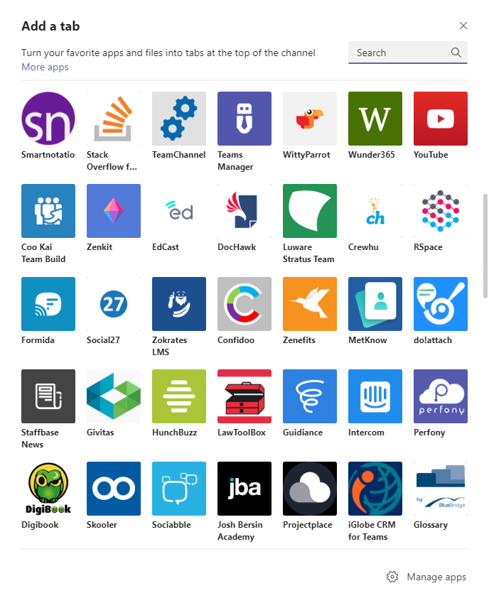

Nos aparece un popup con información del tab que vamos a agregar, pulsamos sobre el botón *Add*
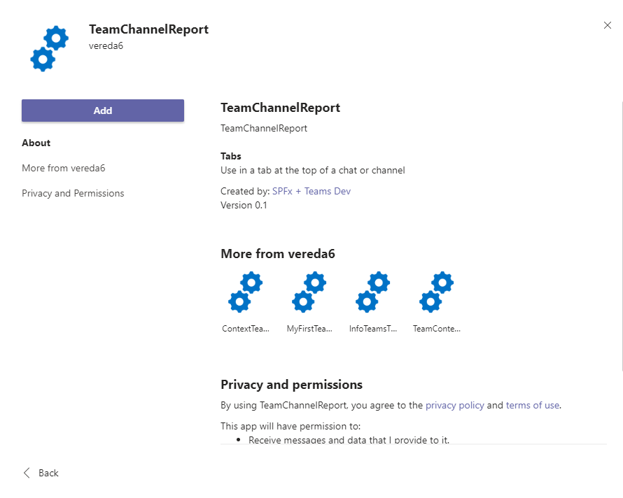

En la siguiente ventana pulsamos sobre el botón *Save* y si queremos agregar un mensaje al canal avisando de que hemos agregado un nuevo tab dejar seleccionado el check.

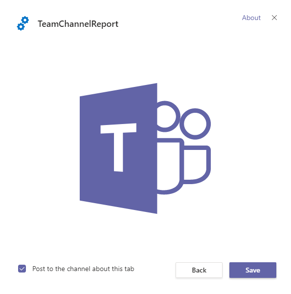