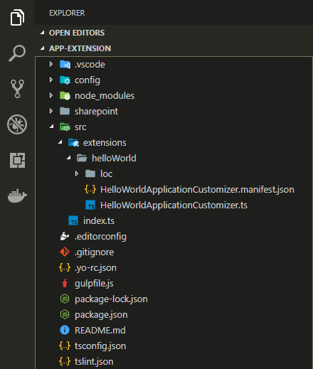
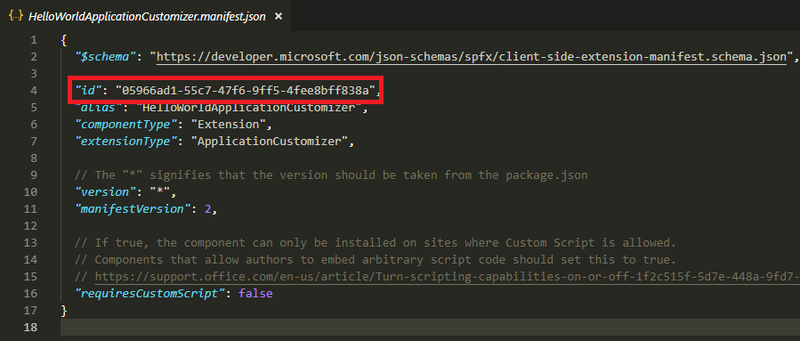
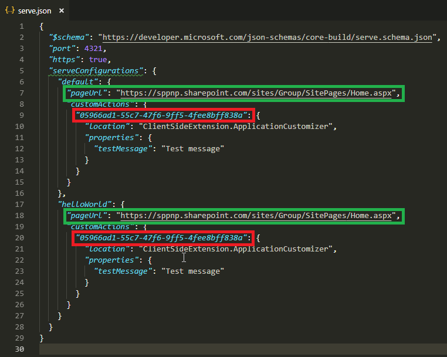
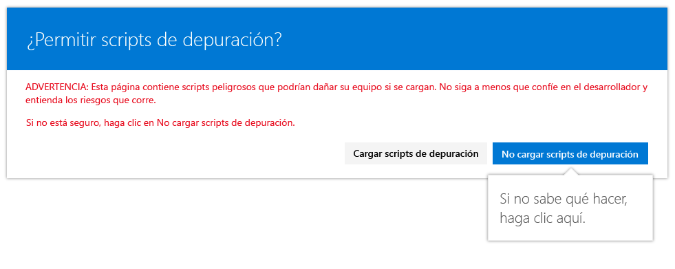
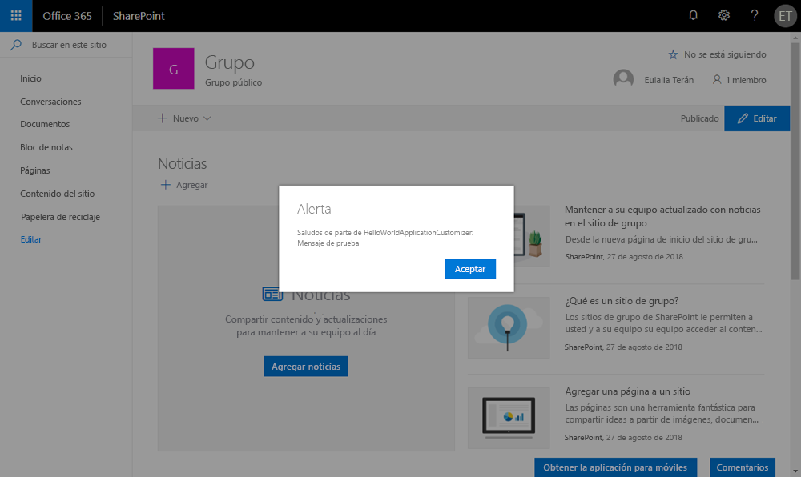
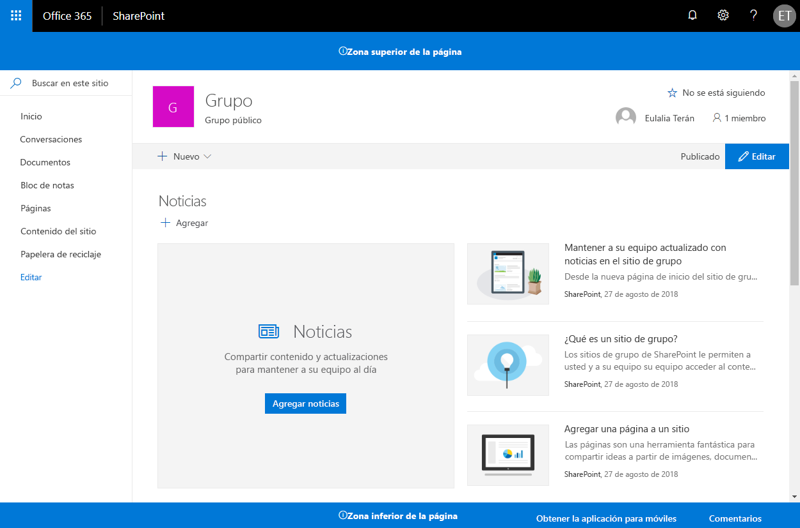

# SPFx Application Customizer Extension

El objetivo de este bootcap es crear una SPFx Extension de tipo Application Customizer que mostrará un mensaje personalizado en el placeholder `top`.

## Creación de la SPFx Extension

1. Abriremos la consola de comandos y navegaremos a la carpeta donde queremos crear nuestro proyecto.

1. Ejecutaremos Yeoman con el siguiente comando:

    ```shell
    yo @microsoft/sharepoint
    ```
        
    Crearemos el webpart con la información que indicamos a continuación:

    * **? What is your solution name?**: spfx-appcustomizer
    * **? Which baseline packages do you want to target for your component(s)?**: SharePoint Online only (latest)
    * **? Where do you want to place the files?**: Create a subfolder with solution name
    * **? Do you want to allow the tenant admin the choice of being able to deploy the solution to all sites immediately without running any feature deployment or adding apps in sites?**: No
    * **? Will the components in the solution require permissions to access web APIs that are unique and not shared with other components in the tenant?**: No
    * **? Which type of client-side component to create?**: Extension
    * **? Which type of client-side extension to create?**: Application Customizer
    * **? What is your Application Customizer name?**: spfx-appcustomizer
    * **? What is your Application Customizer description?**: spfx-appcustomizer description

    Una vez se haya provisionado la estructura de carpetas requerida para el proyecto, el generador se descargará toda la dependencia de paquetes a través de NPM.

1. Una vez creada la extensión, la abrimos en Visual Studio Code con el comando:

    ```shell
    code .
    ```

    La estructura básica que encontraremos será la siguiente:

    

1. Localizaremos el archivo `HelloWorldApplicationCustomizer.manifest.json` de nuestra extension y nos anotaremos el ID de la aplicación, ya que lo necesitaremos posteriormente para desplegar nuestra solución en SharePoint.

    

## Depurar nuestro Application Customizer

A diferencia de un webpart, una SPFx extension no se puede depurar en el Workbench de SharePoint por lo que tendremos que desplegarlo directamente en una página de nuestro SharePoint Online. Sin embargo, no tenemos que desplegar nuestra personalización en el App Catalog, por lo que incluso la experiencia para depurarla será simple y eficiente.

1. Abrir el archivo `serve.json` de la carpeta `config`.

    En él podremos ver que este fichero se ha actualizado con la configuración básica de nuestro proyecto. Podemos ver que debajo del apartado _customActions_ existe un GUID específico que coincide con el componente del proyecto que se creó en el scaffolding de la solución. Si se añaden nuevos componentes, se deberá actualizar el archivo para realizar las pruebas.

1. Actualizar la clave `pageURL` para que coincida con la de nuestro tenant. Un ejemplo podría ser la siguiente URL:

    https://microsoft365bootcamp.sharepoint.com/sites/madrid/SitePages/Home.aspx

    Por lo tanto, el archivo `serve.json` debería ser similar a esto:

    

1. Posteriormente ejecutaremos el proyecto con el siguiente comando:

    ```shell
    gulp serve
    ```

1. Abrimos con el explorador la URL que hemos indicado en nuestro `serve.json` y seleccionaremos `Cargar scripts de depuración` para seguir cargando los scripts.

    

    Y podremos ver el mensaje de cuadro de diálogo en la página:

    

## Modificar el SPFx Application Customizer para acceder y modificar placeholders de la página

1. Instalar el paquete `@microsoft/sp-office-ui-fabric-core` para habilitar la importación de `SPFabricCore.scss`. Utilizaremos Office UI Fabric para definir los estilos en nuestros placeholders.

    ```shell
    npm install @microsoft/sp-office-ui-fabric-core
    ```

1. Crear un nuevo fichero llamado `AppCustomizer.module.scss` y le pondremos el siguiente código:

    ```css
    @import '~@microsoft/sp-office-ui-fabric-core/dist/sass/SPFabricCore.scss';

    .app {
      .top {
          height:60px;
          text-align:center;
          line-height:2.5;
          font-weight:bold;
          display: flex;
          align-items: center;
          justify-content: center;
          background-color: $ms-color-themePrimary;
          color: $ms-color-white;

      }

      .bottom {
          height:40px;
          text-align:center;
          line-height:2.5;
          font-weight:bold;
          display: flex;
          align-items: center;
          justify-content: center;
          background-color: $ms-color-themePrimary;
          color: $ms-color-white;
      }
    }
    ```

1. Abrimos el archivo `HelloWorldApplicationCustomizer.ts` y agregaremos `PlaceholderContent` y `PlaceholderName` a la importación del paquete `@microsoft/sp-application-base`.

    ```ts
    import {
        BaseApplicationCustomizer, 
        PlaceholderContent,
        PlaceholderName
    } from '@microsoft/sp-application-base';
    ```

    Y agregaremos los siguientes imports:

    ```ts
    import styles from './AppCustomizer.module.scss';
    import { escape } from '@microsoft/sp-lodash-subset';
    ```

1. En el archivo `HelloWorldApplicationCustomizer.ts`, actualizaremos la interfaz `IHelloWorldApplicationCustomizerProperties` para agregarle nuevas propiedadesde encabezado y pie de página:

    ```ts
    export interface IHelloWorldApplicationCustomizerProperties {
      Top: string;
      Bottom: string;
    }
    ```

1. Añadir las siguientes variables privadas en la clase `HelloWorldApplicationCustomizer`.

    ```ts
    export default class HelloWorldApplicationCustomizer
    extends BaseApplicationCustomizer<IHelloWorldApplicationCustomizerProperties> {

    // These have been added
    private _topPlaceholder: PlaceholderContent | undefined;
    private _bottomPlaceholder: PlaceholderContent | undefined;
    ```

1. Actualizamos el código del método `onInit`:

    ```ts
    @override
    public onInit(): Promise<void> {
      Log.info(LOG_SOURCE, `Initialized ${strings.Title}`);

      // Wait for the placeholders to be created (or handle them being changed) and then render.
      this.context.placeholderProvider.changedEvent.add(this, this._renderPlaceHolders);
  
      return Promise.resolve<void>();
    }
    ```

1. Creamos un método privado `_renderPlaceHolders` con el siguiente código:

    ```ts
    private _renderPlaceHolders(): void {
        console.log("HelloWorldApplicationCustomizer._renderPlaceHolders()");
        console.log(
            "Available placeholders: ",
            this.context.placeholderProvider.placeholderNames
                .map(name => PlaceholderName[name])
                .join(", ")
        );

        // Handling the top placeholder
        if (!this._topPlaceholder) {
            this._topPlaceholder = this.context.placeholderProvider.tryCreateContent(
                PlaceholderName.Top,
                { onDispose: this._onDispose }
            );

            // The extension should not assume that the expected placeholder is available.
            if (!this._topPlaceholder) {
                console.error("The expected placeholder (Top) was not found.");
                return;
            }

            if (this.properties) {
                let topString: string = this.properties.Top;
                if (!topString) {
                    topString = "(Top property was not defined.)";
                }

                if (this._topPlaceholder.domElement) {
                    this._topPlaceholder.domElement.innerHTML = `
                    <div class="${styles.app}">
                        <div class="${styles.top}">
                            <i class="ms-Icon ms-Icon--Info" aria-hidden="true"></i> ${escape(
                                topString
                            )}
                        </div>
                    </div>`;
                }
            }
        }

        // Handling the bottom placeholder
        if (!this._bottomPlaceholder) {
            this._bottomPlaceholder = this.context.placeholderProvider.tryCreateContent(
                PlaceholderName.Bottom,
                { onDispose: this._onDispose }
            );

            // The extension should not assume that the expected placeholder is available.
            if (!this._bottomPlaceholder) {
                console.error("The expected placeholder (Bottom) was not found.");
                return;
            }

            if (this.properties) {
                let bottomString: string = this.properties.Bottom;
                if (!bottomString) {
                    bottomString = "(Bottom property was not defined.)";
                }

                if (this._bottomPlaceholder.domElement) {
                    this._bottomPlaceholder.domElement.innerHTML = `
                    <div class="${styles.app}">
                        <div class="${styles.bottom}">
                            <i class="ms-Icon ms-Icon--Info" aria-hidden="true"></i> ${escape(
                                bottomString
                            )}
                        </div>
                    </div>`;
                }
            }
        }
    }
    ```

1. Por último, volveremos a probar el código y veremos que se han creado un _header_ y un _footer_ en nuestro sitio:

    