# spfx avanzado - Invocando una Azure Function securizada por Azure AD desde spfx

En este lab, vamos a ver como podemos crear una __Azure Function__, y securizarla con __Azure Active Directory__ (AAD) fácilmente, usando el asistente del propio portal de Azure, para luego consumir dicha función desde un webpart de _spfx_. Además, también veremos como hacer un "segundo salto", y desde la Función de Azure, consumir la __MS Graph API__ con el contexto del usuario logado en SharePoint. Para esto último, haremos uso del "On Behalf Of" flow de oAuth2, y nos ayudará la librería _MSAL_ (Microsoft Authentication Library).

Para facilitar la consecución del lab, partiremos de un proyecto base, donde ya tenemos preparadas algunas cosas básicas de "scaffolding", y otros puntos que no aportan mucho a la temática del lab.

Para este lab son necesarios los siguiente pre-requisitos:
- Visual Studio 2017 o superior
- Visual Studio Code
- Cliente de Git instalado
- Disponer de una tenant de Office 365. Puedes conseguir una tenant de desarrollo desde el siguiente enlace: [https://developer.microsoft.com/en-us/office/dev-program#Subscription](https://developer.microsoft.com/en-us/office/dev-program#Subscription)
- Disponer de una Subscripción de Azure. Puedes conseguir una subscripción de 30 días gratis en el siguiente enlace: [https://azure.microsoft.com/en-us/free/](https://azure.microsoft.com/en-us/free/)
- Idealmente, la subscripción de Azure debe estar vinculada a la tenant de Office 365. Si partes de cero, primero obtén tu Tenant de desarrollo de Office 365, y luego puedes seguir los pasos de este enlace para obtener la subscripción de Azure vinculada a la tenant de Office 365: [https://docs.microsoft.com/en-us/azure/billing/billing-use-existing-office-365-account-azure-subscription](https://docs.microsoft.com/en-us/azure/billing/billing-use-existing-office-365-account-azure-subscription)
- Si ya tienes una tenant y una subscripción por separado, puedes seguir los pasos de este video para vincularlas: [https://channel9.msdn.com/Series/Microsoft-Azure-Tutorials/Associate-an-Office-365-tenant-with-an-Azure-subscription](https://channel9.msdn.com/Series/Microsoft-Azure-Tutorials/Associate-an-Office-365-tenant-with-an-Azure-subscription)
- Si todavía no has desarrollado con Spfx, o acabas de crear tu Tenant de Office 365, asegúrate de que has seguido todos los pasos de este artículo: [https://docs.microsoft.com/en-us/sharepoint/dev/spfx/set-up-your-development-environment](https://docs.microsoft.com/en-us/sharepoint/dev/spfx/set-up-your-development-environment)

Estos son los puntos principales del lab:
- Clonar el proyecto base
- Publicar la Azure Function en la subscripción Azure
- Añadir varias App Settings a la Function
- Securizar la Function con AAD usando el asistente del propio portal
- Habilitar CORS en nuestra Function
- Configurar un _service principal_ en SharePoint
- Completar algunos métodos del webpart spfx
- Actualizar el código de la Function para consumir MS Graph API
- Test de todo usando el Workbench de SharePoint Online

Si todo ha ido bien, en el _workbench_ de SPO podremos añadir un par de webparts, el primero, llamado _MarvelHeroes_, cargará un listado de varios super héroes (los datos vienen de la Azure Function, y están securizados usando AAD):

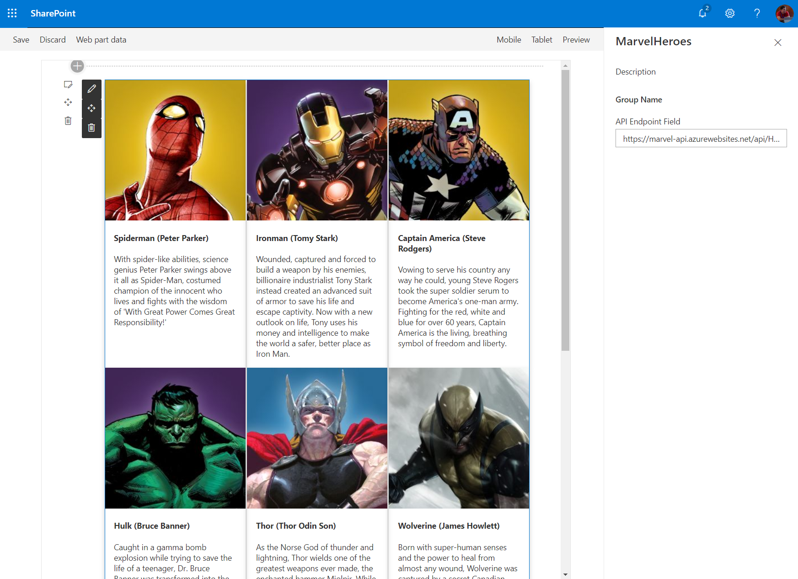

El segundo webpart disponible, llamado _FunctionFlowsToGraphTester_, mostrará información del usuario logado, obtenida de la MS Graph API (a través del ME endpoint: https://graph.microsoft.com/v1.0/me):

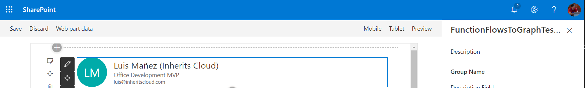

## Clonar proyecto base

Tenéis todos los laboratorios del evento en el siguiente repositorio de GitHub

```ps
git clone https://github.com/CompartiMOSS/Microsoft-365-Developer-Bootcamp-Madrid.git
```

Este lab lo podéis encontrar en la ruta:

__...SPFX/SPfx-Advanced/funcionsecurizada/__

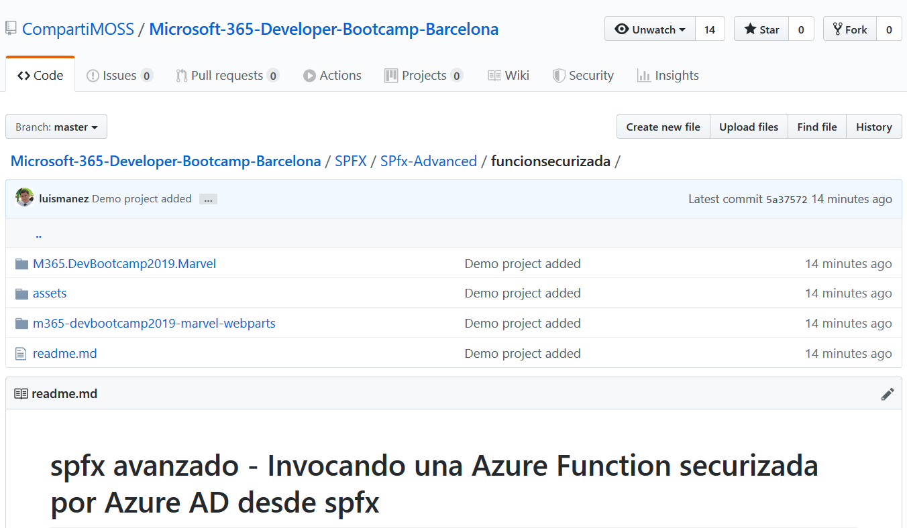

En dicho folder hay 2 carpetas principales:
- Azure Function: Esta Function se comporta como una API, y expone un método que nos va a devolver un listado de super-héroes, y otro método que llamará a MS Graph API para obtener información del usuario logado. Inicialmente, no todo el código de la Function está hecho. Más adelante modificaremos este proyecto para añadirle otra función/endpoint
- spfx webparts project: este proyecto contiene dos webparts que harán uso de la Function

## Publicar la Function a Azure

Nuestro siguiente paso será publicar la Azure Function, para ello podemos utilizar Visual Studio. Podemos crear la Function App primero desde el portal, o dejar que Visual Studio la cree por nosotros. Si no sabes cómo publicar una Function desde Visual Studio, este enlace te explica cómo hacerlo: [https://docs.microsoft.com/en-us/azure/azure-functions/functions-develop-vs#publish-to-azure](https://docs.microsoft.com/en-us/azure/azure-functions/functions-develop-vs#publish-to-azure)

Una vez publicado, tu Function App debe parecerse a esto:

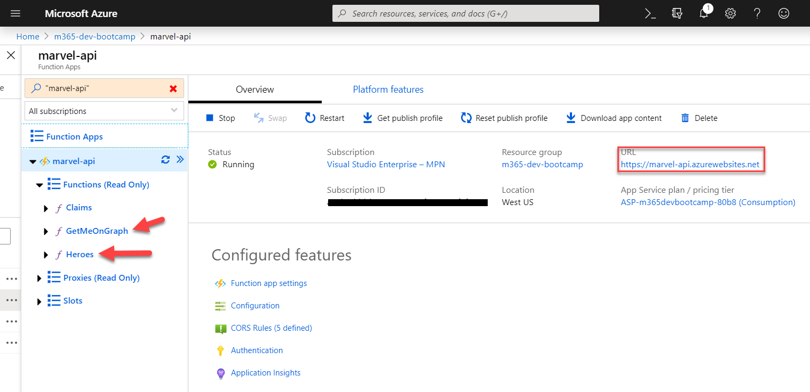

Guarda la URL, ya que la necesitaremos más tarde. En este punto, las funciones son anónimas, pero sólo la función _Heroes_ funcionará con acceso anónimo, ya que las otras dos necesitan el contexto de un usuario logado. Si quieres puesde poner la URL de la función _Heroes_ en un browser (o mejor en [Postman](https://www.getpostman.com/)), y obtendrás un JSON con un listado de súper héroes.

## Securizar la Function App con Azure AD

Ahora es momento de añadir seguridad a nuestra Function App. Para ello usaremos el propio portal de Azure y su asistente para securizar Function Apps.

Primero, pinchamos en el enlace de: _Authentication / Authorization_

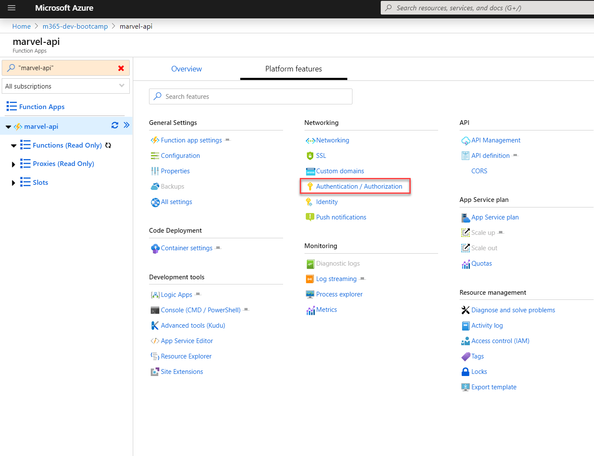

Ahora habilitamos la _Authentication_, y seleccionamos Azure AD

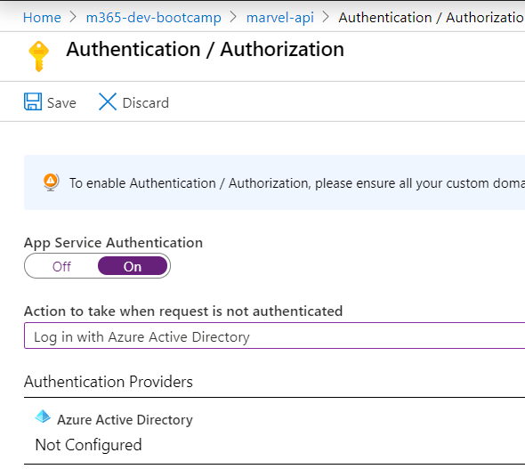

Pasamos a confiurar el _Authentication Provider_ de Azure AD, seleccionamos la opción _Express_, y dejamos que cree una nueva App de Azure AD

__Nota__: Para la configuración Express, es necesario que la suscripción de Azure esté en la misma Tenant de Office 365. Si no es el caso, tendrás que configurar la Avanzada. Aquí tienes detalle de cómo hacerlo: [https://docs.microsoft.com/en-us/azure/app-service/configure-authentication-provider-aad#-configure-with-advanced-settings](https://docs.microsoft.com/en-us/azure/app-service/configure-authentication-provider-aad#-configure-with-advanced-settings)

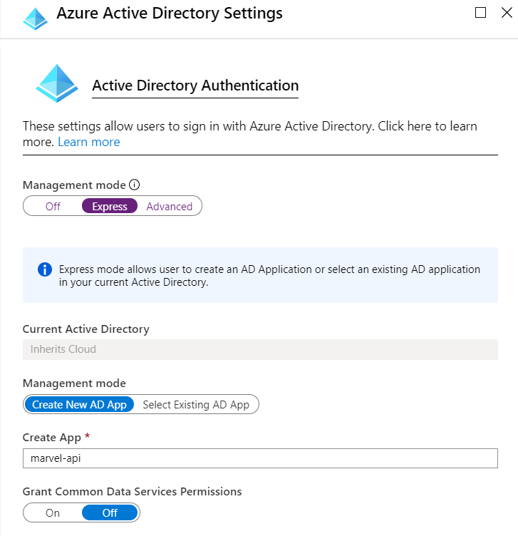

Una vez la configuración express ha sido aplicada, volvemos al mismo sitio, pero en este caso seleccionamos el modo _Advanced_, ya que necesitamos tunear algunas de las cosas que ha configurado el _express mode_

Primero, copia y guarda a buen recaudo el _Client Id_ y _Client Secret_ generados. Ahora, añade la URL de la Function App (recuerda que te dije que la copiaras antes? :), si no lo hiciste, vuelve a la Function App y hazte con esa URL), a la lista de __Allowed Token Audiences__

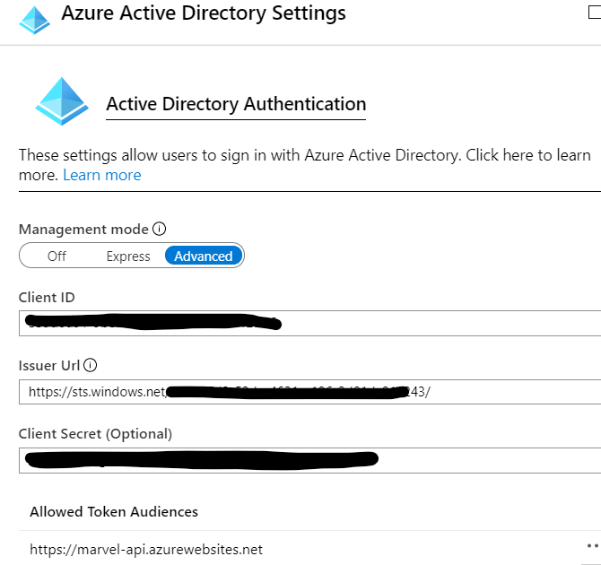

__Nota__: Asegúrate de que guardas los cambios. Hay un botón __Save__ en la _blade_ anterior.

Una vez finalizados estos pasos, nuestra Function App ya estará securizada por Azure AD, así que ya no podremos llamar a ninguna de las Funciones, sin proporcionar un Token válido. De cómo se obtiene dicho Token, lo veremos en la parte de los webparts de spfx, pero la mayor parte de la magia nos la facilitará el propio spfx framework!

Antes de continuar, desde el portal de Azure, vete al Azure Active Directory, y en la sección de Aplicaciones, verás que el asistente del paso anterior, ha registrado una nueva App en Azure AD.

## Configurar Settings en la Function App

Una vez securizada, es hora de añadir algunas Settings a la Function App, que se utilizan en código en la función que llamará a Graph API y que desarrollaremos más adelante.

Añade las siguiente Settings a la function App:
- ClientId: con el client id del paso anterior
- ClientSecret: el secret generado al configurar la seguridad en el paso anterior

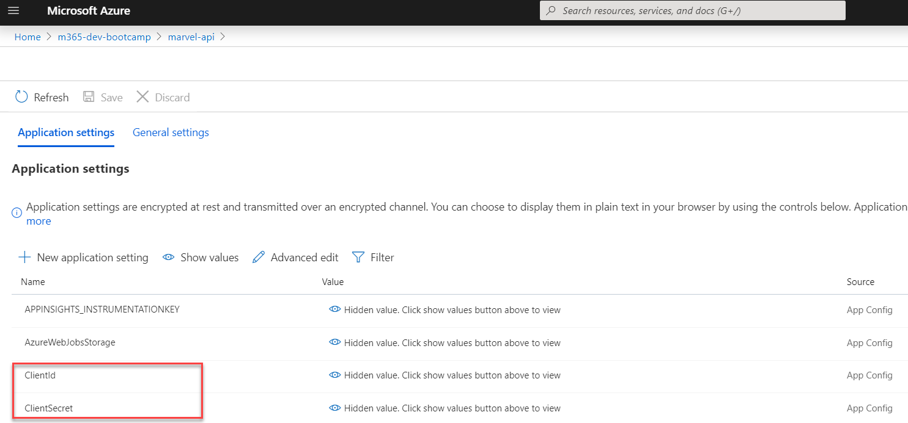

## Habilitar CORS en Function App

Los endpoints de nuestra Function App van a ser invocados desde spfx, es decir, desde Client site (javascript en el browser), así que tenemos que habilitar CORS para que esto sea posible. Para ello nos vamos a las _Platform features_ de la Function App, y pinchamos en el link de CORS:

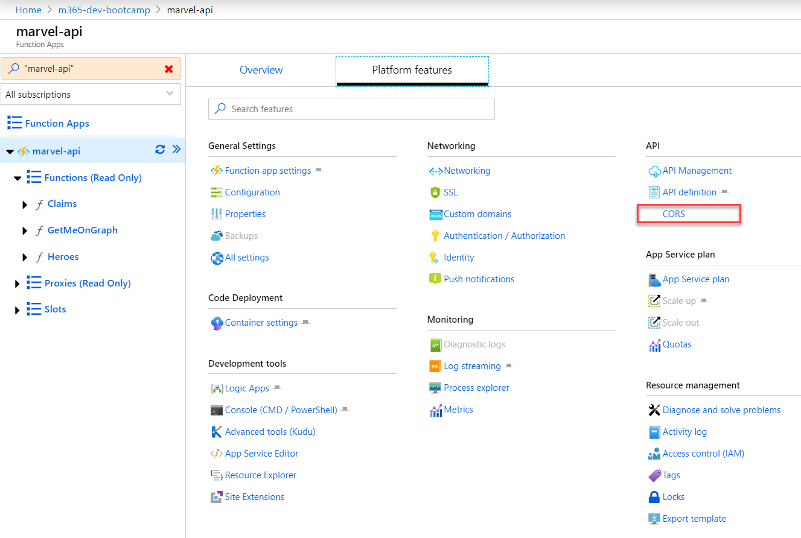

En la lista de _Origins Allowed_ asegúrate de incluir la URL principal de SharePoint: __https://[TENANT].sharepoint.com__

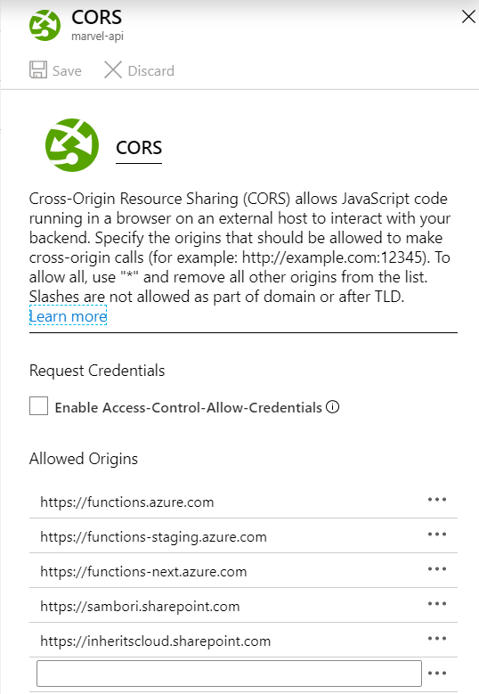

## Configuración de un service principal en SharePoint para nuestra API

Llegados a este punto, necesitamos configurar SharePoint para permitir que pueda comunicarse con nuestra API (Function App).

Esto puede hacerse de varias formas, y las diferentes formas de hacerlo y sus ventajas / inconvenientes están muy bien explicados en este artículo de Andrew Connell [https://www.andrewconnell.com/blog/consider-avoiding-declarative-permissions-with-azure-ad-services-in-sharepoint-framework-projects](https://www.andrewconnell.com/blog/consider-avoiding-declarative-permissions-with-azure-ad-services-in-sharepoint-framework-projects)

Te recomiendo hacerlo usando el Office365 cli, y evitar, tal como dice AC, la declaración a nivel de _manifest_ en el mismo proyecto spfx. La mayor ventaja que yo le veo, es que si lo hacemos desde O365 cli, vamos a poder probar nuestros webparts spfx en el mismo workbench de SharePoint, sin necesidad de hacer Deploy de la solución a SharePoint.

Para ello, primero tenemos que instalar el Office365 cli (si no lo tenemos ya, claro). Podemos hacerlo usando _npm_:

```ps
npm i -g @pnp/office365-cli
```

una vez instalado, debemos conectarnos a nuestro SharePoint, en este enlace tienes como hacerlo [https://pnp.github.io/office365-cli/user-guide/connecting-office-365/](https://pnp.github.io/office365-cli/user-guide/connecting-office-365/)

Una vez conectados, lanza el siguiente comando:

```ps
spo serviceprincipal grant add --resource "[YOUR_APP_NAME]" --scope "user_impersonation"
```

__Nota:__ el nombre de la App lo puedes ver en la configuración de seguridad de la Function App.
__user_impersonation__ es el nombre del scope que está definido en la App en Azure AD (podríamos configurar nuestra App para tener varios _scopes_, y solicitar acceso a los scopes que nos interesen)

## Code Heroes Webpart!

Es hora de poner algo de código en nuestro webpart spfx. En este punto vamos a completar el webpart que llamará al endpoint de _Heroes_ y obtendrá un listado de super héroes que mostrará en pantalla.

Antes de nada, situate en la carpeta: _...\m365-devbootcamp2019-marvel-webparts_, y vamos primero a instalar todos los _packages_ necesarios para el proyecto:

```ps
npm install
```

Una vez restaurados los _packages_ (de repente tendremos un folder _node_modules_ con un montón de archivos dentro), es hora de crear un método que llamará a nuestra API de forma segura. Para ello, hemos creado una clase en __services/HeroeService.ts__. Dentro de esta clase verás un método:

```ts
public async getHeroes(): Promise<IHeroe[]> {
```

En este método vamos a hacer uso de la clase del framework __AadHttpClientFactory__ (que pasaremos al constructor de la clase desde el webpart spfx) para obtener un cliente Http que podrá comunicarse con nuestra API de forma segura. Será esta clase quien hará toda la magia para obtener un Token de Azure AD válido para nuestra API. Vamos a hacer uso de _async / await_ para facilitar las operaciones asíncronas, en vez de trabajar con _Promises_.

Antes de nada, actualiza el valor de la constante __API_RESOURCE_URI__ con la URl principal de la Function App:

```ts
const API_RESOURCE_URI: string = "https://marvel-api.azurewebsites.net";
```

Lo siguiente es obtener un _client_ desde la _factory_

```ts
const aadHttpClient: AadHttpClient = await this._aadHttpClientFactory.getClient(API_RESOURCE_URI);
```

Ya con este, podemos llamar a nuestro endpoint de súper héroes!

```ts
const httpClientResponse: HttpClientResponse = await aadHttpClient.get(this._endpoint, AadHttpClient.configurations.v1);
```

Copia el siguiente snippet dentro del método _getHeroes_:

```ts
    const aadHttpClient: AadHttpClient = await this._aadHttpClientFactory.getClient(API_RESOURCE_URI);
    const httpClientResponse: HttpClientResponse = await aadHttpClient.get(this._endpoint, AadHttpClient.configurations.v1);

    if (httpClientResponse.status !== 200) {
      throw new Error(`Unable to get data from API. Ensure the API is secured by Azure AD, and the endpoint configured is correct (${this._endpoint})`);
    }

    return await httpClientResponse.json();
```

Ahora pasemos a echar un vistazo al webpart __MarvelHeroesWebpart.ts__ 

Primero, edita el manifest del webpart, para que por defecto tenga el valor adecuado en la propiedad del webpart que define la URL del endpoint de super heroes que queremos llamar. Edita el fichero: __...\m365-devbootcamp2019-marvel-webparts\src\webparts\marvelHeroes\MarvelHeroesWebPart.manifest.json__

El webpart usa React, y podemos ver como el contexto del webpart se pasa al componente principal de React:

```ts
const element: React.ReactElement<IMarvelHeroesProps > = React.createElement(
      MarvelHeroes,
      {
        apiEndpoint: this.properties.apiEndpoint,
        context: this.context
      }
    );
```

En dicho context, es donde tenemos disponible la _factory_ que utilizará el servicio _HeroeService_ que hemos completado hace en el paso anterior. Fíjate en el siguiente código del componente __MarvelHeroes.tsx__

```ts
private _heroeService: HeroeService;

  constructor(props: IMarvelHeroesProps) {
    super(props);

    this._heroeService = new HeroeService(this.props.apiEndpoint, this.props.context.aadHttpClientFactory);

    this.state = {
      heroes: [],
      oops: null
    };
  }
```

Es también en dicho componente, donde haremos la llamada a la API, y obtendremos nuestro listado de super héroes. Fíjate en el método __componentDidMount__

```ts
public componentDidMount(): void {
    this._heroeService.getHeroes().then((heroes: IHeroe[]) => {
      this.setState({
        heroes: heroes
      });
    }).catch(error => {
      console.log(error);
      this.setState({
        oops: 'Something went wrong... call the police!'
      });
    });
  }
```

Una vez obtenemos los datos, actualizamos el _state_ del componente, para que vuelva a pintarse, esta vez mostrando el listado de héroes. El resto de componentes React del webpart son para la UI (por modularizar el código)

Llegados a este punto, ya podemos probar nuestro __MarvelHeroesWebPart__. Para ello, ejecutamos el comando:

```ps
gulp serve --nobrowser
```

Esto compilará todo el TS, etc, y se quedará sirviendo nuestra solución. Ahora tenemos que añadir el webpart al workbench de SPO. Para ello, navega a tu SharePoint (a la site collection que quieras usar, pero te recomiendo que utilices una Modern Site Collection). El workbench lo puedes encontrar en la URL:

```
https://TENANT.sharepoint.com/{site collection}/_layouts/15/workbench.aspx
```

Añade el webpart, y si todo ha ido bien, tendrás un bonito listado de super héroes :)

## Mejoremos nuestra Function para obtener datos de MS Graph API

Hasta ahora hemos visto lo sencillo que ha sido securizar una Function con Azure AD (next, next, next, done!), y como invocarla desde spfx, donde el framework hace toda la magia (y árdua tarea) de obtener el Token.

En este punto, vamos a ir un paso más allá, y vamos a ver como podemos, desde la Function, obtener datos de MS Graph API (y lo mismo aplicaría a casi cualquier API securizada en Azure AD). Dicha llamada se hará en el contexto del usuario logado en SharePoint. Esto es lo que se llama _On Behalf of_ flow en oAuth2.

Es hora de abrir con __Visual Studio__ la solución que se encuentra en: __...funcionsecurizada\M365.DevBootcamp2019.Marvel\M365.DevBootcamp2019.Marvel.sln__

Verás un método sin código:

```cs
[FunctionName("GetMeOnGraph")]
public static async Task<IActionResult> GetMeOnGraph([HttpTrigger(AuthorizationLevel.Anonymous, "get", Route = null)]HttpRequest req, ILogger log)
```

En este método, básicamente lo que necesitamos hacer es, primero, obtener el Bearer Token con el que se ha invocado a la Function. Una vez tenemos el Token, debemos intercambiarlo por otro Bearer Token, destinado para _MS Graph API_. Para dicho intercambio de un Token por otro, haremos uso de la librería __MSAL__

Ahora paso a explicaros las partes más relevantes del código. El Token inicial, nos viene en los _Headers_ de la Request, así que podemos obtenerlo así:

```cs
var userImpersonationAccessToken = req.Headers["Authorization"].ToString().Replace("Bearer ", "");
```

Con dicho Token, podemos crear lo que MSAL llama un __UserAssetion__

```cs
UserAssertion userAssertion = new UserAssertion(userImpersonationAccessToken);
```

Ahora, podemos crear un __ConfidentialClient__, de nuevo usando MSAL (necesitaremos el ClientId y Secret de la App registrada en Azure AD, que antes definimos en las Settings de la Function App):

```cs
var app = ConfidentialClientApplicationBuilder.Create(ClientId)
                   .WithClientSecret(ClientSecret)
                   .WithAuthority(authority)
                   .Build();
```                   

Con el _ConfidentialClient_ y la _UserAssertion_, ya podemos obtener un nuevo Token para MS Graph API:

```cs
var authResult = await app.AcquireTokenOnBehalfOf(
                    new string[] { "https://graph.microsoft.com/.default" }, 
                    userAssertion).ExecuteAsync();

var graphAccessToken = authResult.AccessToken;                    
```

Finalmente, podemos llamar al Endpoint "me" de Graph, adjuntando el nuevo Bearer Token

```cs
var httpClient = new HttpClient();
                httpClient.DefaultRequestHeaders.Authorization = new AuthenticationHeaderValue("Bearer", graphAccessToken);
                httpClient.DefaultRequestHeaders.Accept.Add(new MediaTypeWithQualityHeaderValue("application/json"));
```

El resto del código simplemente procesa el JSON obtenido y lo devuelve Serializado en una clase.

Aquí está el código completo de la Function:

```cs
            try
            {
                string ClientId = Environment.GetEnvironmentVariable("ClientId", EnvironmentVariableTarget.Process);
                string ClientSecret = Environment.GetEnvironmentVariable("ClientSecret", EnvironmentVariableTarget.Process);

                var tenantId = req.HttpContext.User.FindFirst("http://schemas.microsoft.com/identity/claims/tenantid")?.Value;

                if (string.IsNullOrEmpty(tenantId))
                {
                    tenantId = Environment.GetEnvironmentVariable("TenantId", EnvironmentVariableTarget.Process); //For some reason, in localhost only one claim is returned
                }

                string authority = $"https://login.microsoftonline.com/{tenantId}";

                var userImpersonationAccessToken = req.Headers["Authorization"].ToString().Replace("Bearer ", "");
                log.LogInformation("AccessToken: {0}", userImpersonationAccessToken);

                var app = ConfidentialClientApplicationBuilder.Create(ClientId)
                   .WithClientSecret(ClientSecret)
                   .WithAuthority(authority)
                   .Build();

                UserAssertion userAssertion = new UserAssertion(userImpersonationAccessToken);

                var authResult = await app.AcquireTokenOnBehalfOf(
                    new string[] { "https://graph.microsoft.com/.default" }, 
                    userAssertion).ExecuteAsync();

                var graphAccessToken = authResult.AccessToken;
                log.LogInformation("Token OnBehalfOf: {0}", graphAccessToken);

                var httpClient = new HttpClient();
                httpClient.DefaultRequestHeaders.Authorization = new AuthenticationHeaderValue("Bearer", graphAccessToken);
                httpClient.DefaultRequestHeaders.Accept.Add(new MediaTypeWithQualityHeaderValue("application/json"));

                var request = new HttpRequestMessage(HttpMethod.Get, $"https://graph.microsoft.com/v1.0/me");

                var response = await httpClient.SendAsync(request);

                var content = await response.Content.ReadAsStringAsync();

                var user = JsonConvert.DeserializeObject<GraphUser>(content);

                return new OkObjectResult(user);
            }
            catch (Exception ex)
            {
                log.LogError(ex, "Something went wrong");
                throw;
            }
        }        
```

Ahora tenemos que volver a Publicar nuestra Function App a Azure.

## Actualizar URIs en nuestro Graph webpart

Con nuestro nuevo Endpoint, podemos volver a nuestro proyecto spfx, y actulizar las URIs que apuntan a él. Abre el fichero __m365-devbootcamp2019-marvel-webparts\src\services\GraphService.ts__ y actualiza la URI:

```ts
const API_RESOURCE_URI: string = "https://XXXXXXXX.azurewebsites.net";
```

Echa un vistazo al resto del código, verás que hemos seguido el mismo proceso que en el _Heroes webpart_

Ya solo queda volver al workbench de SharePoint, y añadir el webpart __FunctionFlowsToGraphTesterWebPart__ (sí!, había nombres peores...). Si todo ha ido bien, verás que aparece información del usuario Logado, que hemos obtenido llamando a Graph!

__Enhorabuena!!__ has completado el Lab.

Os he dejado el lab completo en mi GitHub (aún así, recuerda que tendrás que editar URIs, settings, etc):
[https://github.com/luismanez/m365-dev-bootcamp-bcn-2019](https://github.com/luismanez/m365-dev-bootcamp-bcn-2019)